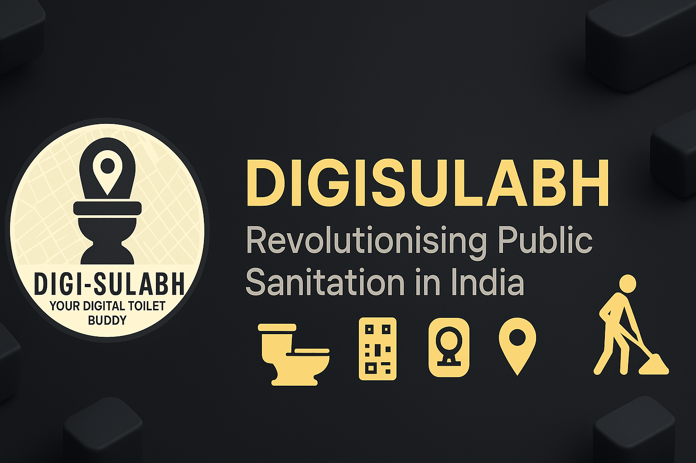
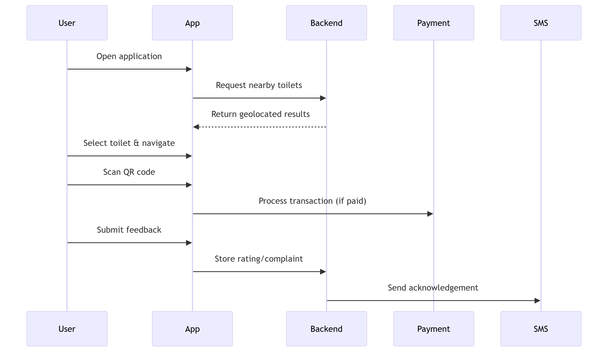
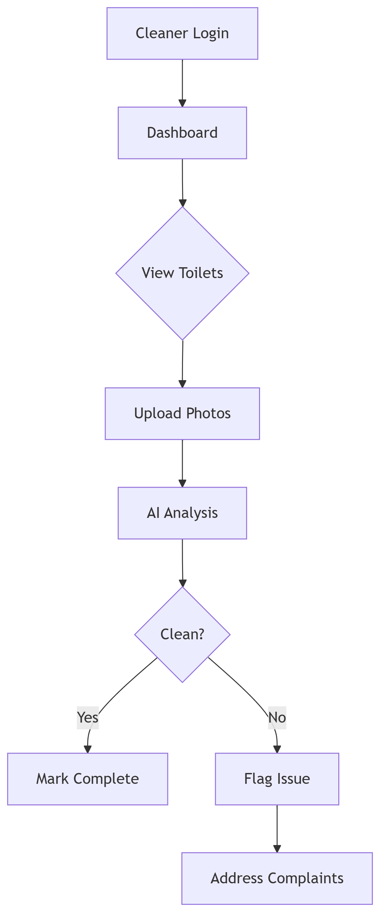
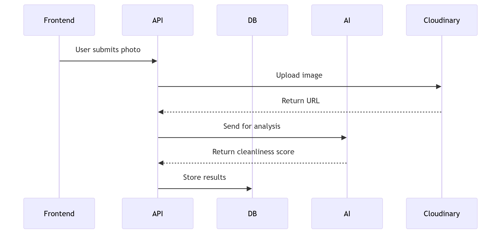

# 🚽 DigiSulabh – Revolutionising Public Sanitation

### Smart Public Sanitation Platform for Modern India

 **DigiSulabh** is a smart, scalable, full-stack public sanitation solution designed to **digitise and automate Sulabh Shauchalayas** across India, empowering citizens, improving hygiene, and bringing accountability to public infrastructure through digital innovation, real-time monitoring, and AI-powered cleanliness verification.
 <!-- Replace with your banner -->


---
## 🖼️ Screenshots

| Home Page     | Feedback      | Dashboard     |
| ------------- | ------------- | ------------- |
| *(Add image)* | *(Add image)* | *(Add image)* |

---

## 🎯 The Problem We're Solving

Public sanitation in India faces critical challenges:
- **250+ million people** rely on public toilets daily
- Lack of real-time information about toilet availability and cleanliness
- No accountability mechanism for maintenance staff
- Poor user feedback systems leading to hygiene issues
- Manual processes that don't scale with urban growth

**DigiSulabh transforms this by digitizing the entire public toilet ecosystem.**

---

## 💡 Our Solution

A complete digital infrastructure that connects users, cleaners, and administrators through:

**For Citizens:** Find clean, accessible toilets with real-time information and reliable feedback systems

**For Cleaners:** Streamlined daily workflows with AI-assisted verification and complaint management

**For Administrators:** Data-driven insights for better resource allocation and accountability

---

## ✨ Key Features

| 🔍 **Find Toilets**          | Locate nearest Sulabh Shauchalayas using GPS & OpenStreetMap                  |
|-----------------------------|--------------------------------------------------------------------------------|
| 📷 **QR Access**             | Scan QR codes to access toilets (Stripe integration for paid ones)             |
| 🧼 **Cleanliness AI**        | Daily photo uploads by cleaners auto-analyzed by AI model                      |
| 📣 **Feedback + Complaints** | Ratings and issues with priority tagging + tracking                            |
| 📲 **Acknowledgement Alerts**| n8n + Twilio integration for SMS/email confirmation                            |
| 🧑‍🔧 **Cleaner Dashboard**    | View assigned toilets, submit photos, manage complaints (OAuth-secured)         |
| ☁️ **Cloud Storage**         | Cloudinary + Multer used to store photos and QR images                         |
| 🔄 **ETL Pipeline (WIP)**    | Automated scraping from official Sulabh websites to populate toilets           |
| 🔎 **Search & Filter**       | (Coming Soon) Filter toilets based on amenities, cleanliness, and distance     |

---

## 🧰 Tech Stack

| Layer      | Tools Used                                                            |
| ---------- | --------------------------------------------------------------------- |
| Frontend   | React.js, Tailwind CSS, OpenStreetMap API                             |
| Backend    | Node.js, Express.js                                                   |
| Database   | MongoDB Atlas                                                         |
| Storage    | Cloudinary + Multer                                                   |
| Auth       | OAuth (Google planned for cleaner login)                              |
| Automation | n8n (for workflows), Twilio (SMS alerts)                              |
| Payments   | Stripe (for paid toilets via QR)                                      |
| AI         | Python-based cleanliness classifier for uploaded images               |
| ETL        | Scraping Sulabh Shauchalaya government site to auto-populate database |

---

## 🔄 User Workflow

### For Citizens:



```
1. Open DigiSulabh → GPS locates nearby toilets
2. View toilet details (cleanliness rating, amenities, distance)
3. Navigate using integrated OpenStreetMap
4. Scan QR code → Complete Stripe payment (if required)
5. Use facility → Submit rating and feedback
6. Receive SMS/email acknowledgment via Twilio
```

### For Cleaners:

flowchart TD
    A[Cleaner Login] --> B[Dashboard]
    B --> C{View Toilets}
    C --> D[Upload Photos]
    D --> E[AI Analysis]
    E --> F{Clean?}
    F -->|Yes| G[Mark Complete]
    F -->|No| H[Flag Issue]
    H --> I[Address Complaints]

```
1. OAuth login to cleaner dashboard
2. View assigned toilets and pending complaints
3. Upload daily cleanliness photos
4. AI model analyzes photos → Auto-flags issues
5. Address complaints and update status
6. Receive performance analytics
```

### For System:
```
1. AI processes uploaded photos for cleanliness verification
2. n8n workflows trigger based on complaints/ratings
3. ETL pipeline updates toilet database from official sources
4. Automated alerts sent to relevant stakeholders
5. Real-time analytics generated for decision making
```

---

## 🏗️ System Architecture



DigiSulabh follows a **microservices-inspired architecture** with clear separation of concerns:

- **Frontend Layer**: React SPA with responsive design and offline capabilities
- **API Gateway**: Express.js backend handling all business logic
- **Data Layer**: MongoDB Atlas with optimized schemas for geospatial queries
- **AI Service**: Python-based image classification service
- **Automation Layer**: n8n workflows for complex business processes
- **Storage Layer**: Cloudinary CDN for media assets
- **External Integrations**: OpenStreetMap, Stripe, Twilio, OAuth providers

---

## 📊 Current Development Status

| Component                | Status           | Details                                    |
|--------------------------|------------------|--------------------------------------------|
| 🏠 Landing Page          | ✅ Complete      | Responsive design with feature overview    |
| 📱 Toilet Finder         |  ✅ Complete   | GPS integration and mapping functionality  |
| 📝 Feedback System       | ✅ Complete      | Rating and complaint submission            |
| 🧑‍🔧 Cleaner Dashboard    |   ✅ Complete   | Photo uploads working, OAuth pending       |
| 💳 Stripe Integration    | 🔄 In Progress     | QR-based payment processing                |
| 🤖 AI Cleanliness Model  | 🔄 In Progress     | Image classification with 85%+ accuracy   |
| 📧 Notification System   | 🔄 In Progress     | SMS/email via Twilio integration          |
| 🔄 ETL Pipeline          | 🔄 In Progress      | Government website data scraping          |

---


## 🚀 Quickstart (For Developers)

### Prerequisites
- Node.js (v14 or higher)
- MongoDB Atlas account
- Stripe account
- Cloudinary account
- Twilio account

### 1. Clone the repository

```bash
git clone https://github.com/ShreeLite/digi-sulabh.git
cd digi-sulabh
```

### 2. Install dependencies in both frontend and backend

```bash
cd frontend
npm install

cd ../backend
npm install
```

### 3. Setup environment variables

Create a `.env` file in both the frontend and backend directories. Refer to `docs/env.example` for required variables:

```env
MONGO_URI=your_mongodb_atlas_connection_string
PORT=your_backend_port
CLOUDINARY_NAME=your_cloudinary_cloud_name
CLOUDINARY_KEY=your_cloudinary_api_key
CLOUDINARY_SECRET=your_cloudinary_api_secret
STRIPE_SECRET_KEY=your_stripe_secret_key
STRIPE_PUBLISHABLE_KEY=your_stripe_publishable_key
TWILIO_ACCOUNT_SID=your_twilio_account_sid
TWILIO_AUTH_TOKEN=your_twilio_auth_token
N8N_WEBHOOK_URL=your_n8n_webhook_url
OAUTH_CLIENT_ID=your_oauth_client_id
OAUTH_CLIENT_SECRET=your_oauth_client_secret
```

> 🛠 **Tip**: Use [ngrok](https://ngrok.com/) for local webhook testing (Twilio, n8n).

### 4. Run the project

**Frontend** (from frontend directory):
```bash
cd frontend
npm run dev
```

**Backend** (from backend directory):
```bash
cd backend
# Using nodemon:
npm run start
# Or standard node:
npm run server
```

---
## 🔧 Development Setup

### Local Development

1. **Database Setup**: Ensure MongoDB Atlas is configured and running
2. **Environment Variables**: All required environment variables are set
3. **Dependencies**: All npm packages are installed
4. **Services**: External services (Stripe, Twilio, Cloudinary) are configured

### Testing

```bash
# Run frontend tests
cd frontend
npm test

# Run backend tests
cd backend
npm test
```

### Deployment

- **Frontend**: Deploy on Vercel/Netlify
- **Backend**: Deploy on Railway/Heroku
- **Database**: MongoDB Atlas (already cloud-hosted)

---


## 📊 API Endpoints

### User Routes
- `GET /api/toilets/nearby` - Find nearby toilets based on GPS location
- `POST /api/payment/process` - Process payments via Stripe
- `GET /api/toilets/:id/status` - Get real-time toilet status
- `POST /api/feedback` - Submit feedback and complaints
- `GET /api/toilets/:id/qr` - Generate QR code for toilet access

### Cleaner Routes
- `POST /api/cleaner/login` - OAuth login for cleaners
- `POST /api/cleaner/upload` - Upload cleanliness photos
- `GET /api/cleaner/assignments` - Get assigned toilet cleaning tasks
- `PUT /api/cleaner/status/:toiletId` - Update cleaning status

### Admin Routes
- `GET /api/admin/analytics` - Get system analytics and reports
- `POST /api/admin/toilets` - Add new toilet locations
- `PUT /api/admin/toilets/:id` - Update toilet information

---

## 📈 Future Integrations

- 🧠 **Sentiment Analysis** of feedback for better issue detection
- 📊 **Cleaner Performance Scoring** using ML or basic analytics
- 🚿 **IoT Sensor Integration** for real-time cleanliness monitoring
- 🗺️ **Offline Mode** for low-connectivity rural deployment
- 🏛️ **Admin Dashboard** for civic authorities and NGOs
- 🔔 **Push Notifications** for real-time updates
- 📱 **Mobile App** (React Native)

---


## 🧾 Documentation

Explore the deeper documentation:

- [`docs/dev-guide.md`](docs/dev-guide.md) – Project setup + structure
- [`docs/architecture.md`](docs/architecture.md) – Full system architecture
- [`docs/api.md`](docs/api.md) – REST API reference
- [`docs/cleaner-dashboard.md`](docs/cleaner-dashboard.md) – Cleaner interface guide
- [`docs/ai-analysis.md`](docs/ai-analysis.md) – AI model documentation
- [`docs/etl-pipeline.md`](docs/etl-pipeline.md) – Data pipeline details
- [`docs/ui.md`](docs/ui.md) – UI/UX design guidelines

---


## 🤝 Contributing

We welcome new contributors! Here's how to get started:

1. **Fork** the repository
2. **Create** a feature branch (`git checkout -b feature/amazing-feature`)
3. **Commit** your changes (`git commit -m 'Add some amazing feature'`)
4. **Push** to the branch (`git push origin feature/amazing-feature`)
5. **Open** a Pull Request

See [`CONTRIBUTING.md`](CONTRIBUTING.md) for detailed guidelines.

---


---

## 👥 Development Team

Built by Shreem Shukla(@ShreeLite),a first-year Computer Science Engineering student at **IIIT Hyderabad**, combining social impact with technical excellence. This project showcases full-stack development skills, AI integration, and systems thinking applied to civic technology.

---

## 📞 Get Involved

- **🐛 Report Issues**: Help us improve by reporting bugs
- **💡 Suggest Features**: Share ideas for new functionality  
- **🤝 Contribute**: Join our development efforts
- **📢 Spread the Word**: Share DigiSulabh with communities that need it

---


---


## 🐛 Issues & Support

- **Bug Reports**: [Open an issue](https://github.com/ShreeLite/digi-sulabh/issues)
- **Feature Requests**: [Request a feature](https://github.com/ShreeLite/digi-sulabh/issues)
- **Questions**: [Start a discussion](https://github.com/ShreeLite/digi-sulabh/discussions)

---


## 🙏 Acknowledgments

- **Sulabh International** for inspiration and mission alignment
- **Open Source Community** for the amazing tools and libraries
- **IIIT Hyderabad** for fostering innovation and social impact
- **Contributors** who believe in making India cleaner and smarter

---

## 📞 Contact

For questions, suggestions, or collaboration opportunities:

- **Email**: [shreemcream@gmail.com](mailto:your.email@example.com)
- **LinkedIn**: [Shreem Shukla](https://www.linkedin.com/in/shreem-shukla-816982337/)


---
## 🌍 Social Impact

> **DigiSulabh** isn't just code — it's a mission. By merging smart tech with civic responsibility, we aim to fix a long-ignored problem of public hygiene and give dignity to everyone. From citizens to cleaners to administrators — everyone benefits from a cleaner, smarter India.

---

<div align="center">

**Made with ❤️ by ShreeLite for a cleaner, smarter India**

[⭐ Star this repo](https://github.com/ShreeLite/digi-sulabh) | [🍴 Fork it](https://github.com/ShreeLite/digi-sulabh/fork) | [📝 Contribute](CONTRIBUTING.md)

</div>


---

